# 🍵 Express Tea API - Complete Technical Documentation

> A comprehensive guide to building a RESTful Tea Management API with Express.js, Winston logging, and Morgan middleware.

---

## 📁 Project Structure

```
02_Express/
├── 🚀 index.js          # Main server application
├── 📝 logger.js         # Winston logger configuration
├── 📦 package.json      # Project dependencies & scripts
├── 📄 app.log          # Generated log file
└── 🔐 .env             # Environment variables
```

---

## 🎯 1. Main Server Application (`index.js`)

### 💻 Complete Source Code

```javascript
import "dotenv/config";
import logger from "./logger.js";
import morgan from "morgan";

// Import express module to create the server and handle routing
import express from "express";

const app = express(); // Creates the Express app instance
const port = process.env.PORT || 3000; // Port where the server will run

app.use(express.json()); // Middleware to parse JSON bodies
const morganFormat = ":method :url :status :response-time ms";

app.use(
  morgan(morganFormat, {
    stream: {
      write: (message) => {
        const logObject = {
          method: message.split(" ")[0],
          url: message.split(" ")[1],
          status: message.split(" ")[2],
          responseTime: message.split(" ")[3],
        };
        logger.info(JSON.stringify(logObject));
      },
    },
  })
);

// In-memory storage for tea items
let teaData = [];
let nextId = 1;

// Handles adding a new tea item
app.post("/teas", (req, res) => {
  const { name, price } = req.body;
  const newTea = { id: nextId++, name, price };
  teaData.push(newTea);
  res.status(201).send(newTea);
});

// Returns all tea items
app.get("/teas", (req, res) => {
  res.status(200).send(teaData);
});

// Returns a specific tea item by ID
app.get("/teas/:id", (req, res) => {
  const tea = teaData.find((obj) => obj.id === parseInt(req.params.id));
  if (!tea) {
    return res.status(404).send("Tea not found");
  }
  res.status(200).send(tea);
});

// Updates a specific tea item by ID
app.put("/teas/:id", (req, res) => {
  const tea = teaData.find((obj) => obj.id === parseInt(req.params.id));
  if (!tea) {
    return res.status(404).send("Tea not found");
  }
  const { name, price } = req.body;
  tea.name = name;
  tea.price = price;
  res.status(200).send(tea);
});

// Deletes a specific tea item by ID
app.delete("/teas/:id", (req, res) => {
  console.log(`Deleting tea having id : ${req.params.id}`);
  const index = teaData.findIndex((obj) => obj.id === parseInt(req.params.id));
  if (index === -1) {
    return res.status(404).send("tea not found");
  }
  teaData.splice(index, 1);
  return res.status(200).send("deleted");
});

// Starts the server and listens on the defined port
app.listen(port, () => {
  console.log(`Server is running at port : ${port}...`);
});
```

### 🔧 **Function-by-Function Breakdown**

#### 🎪 **Import Dependencies Block**

```javascript
import "dotenv/config";
import logger from "./logger.js";
import morgan from "morgan";
import express from "express";
```

**Purpose:** Loads all necessary modules for the application  
**What it does:** Automatically configures environment variables with dotenv, imports our custom Winston logger, brings in Morgan for HTTP logging, and loads the Express framework for building the web server.

---

#### ⚙️ **Server Configuration Block**

```javascript
const app = express();
const port = process.env.PORT || 3000;
app.use(express.json());
```

**Purpose:** Sets up the Express application with essential middleware  
**What it does:** Creates the Express app instance, configures the server port (environment variable or fallback to 3000), and enables automatic JSON parsing for incoming requests.

---

#### 📊 **Advanced Logging System**

```javascript
const morganFormat = ":method :url :status :response-time ms";

app.use(
  morgan(morganFormat, {
    stream: {
      write: (message) => {
        const logObject = {
          method: message.split(" ")[0],
          url: message.split(" ")[1],
          status: message.split(" ")[2],
          responseTime: message.split(" ")[3],
        };
        logger.info(JSON.stringify(logObject));
      },
    },
  })
);
```

**Purpose:** Creates sophisticated HTTP request logging with structured data  
**What it does:** Intercepts Morgan's log output, parses it into structured components (method, URL, status, response time), and forwards the formatted data to Winston logger. This produces the clean JSON logs we see in our terminal output like `info: {"method":"POST","url":"/teas","status":"201","responseTime":"1.495"}`.

---

#### 💾 **In-Memory Data Storage**

```javascript
let teaData = [];
let nextId = 1;
```

**Purpose:** Simple data persistence layer for development  
**What it does:** Creates an array to store all tea items and maintains an auto-incrementing counter for unique IDs.

---

#### 🎯 **API Endpoints**

##### ➕ **Create Tea Endpoint**

```javascript
app.post("/teas", (req, res) => {
  const { name, price } = req.body;
  const newTea = { id: nextId++, name, price };
  teaData.push(newTea);
  res.status(201).send(newTea);
});
```

**Route:** `POST /teas`  
**Purpose:** Creates a new tea item in the collection  
**What it does:** Extracts tea details from request body, assigns a unique auto-incrementing ID, stores the new tea in memory, and returns the created tea object with HTTP 201 status.

##### 📋 **Get All Teas Endpoint**

```javascript
app.get("/teas", (req, res) => {
  res.status(200).send(teaData);
});
```

**Route:** `GET /teas`  
**Purpose:** Retrieves the complete tea collection  
**What it does:** Simply returns the entire `teaData` array containing all stored tea items with HTTP 200 status.

##### 🔍 **Get Single Tea Endpoint**

```javascript
app.get("/teas/:id", (req, res) => {
  const tea = teaData.find((obj) => obj.id === parseInt(req.params.id));
  if (!tea) {
    return res.status(404).send("Tea not found");
  }
  res.status(200).send(tea);
});
```

**Route:** `GET /teas/:id`  
**Purpose:** Finds and returns a specific tea by its ID  
**What it does:** Searches the tea collection for a matching ID (converting the URL parameter to number), returns 404 with error message if not found, or returns the tea object with 200 status if found.

##### ✏️ **Update Tea Endpoint**

```javascript
app.put("/teas/:id", (req, res) => {
  const tea = teaData.find((obj) => obj.id === parseInt(req.params.id));
  if (!tea) {
    return res.status(404).send("Tea not found");
  }
  const { name, price } = req.body;
  tea.name = name;
  tea.price = price;
  res.status(200).send(tea);
});
```

**Route:** `PUT /teas/:id`  
**Purpose:** Updates an existing tea's information  
**What it does:** Locates the tea by ID, returns 404 if not found, otherwise extracts new data from request body, directly modifies the tea object properties (updating the array reference), and returns the updated tea.

##### 🗑️ **Delete Tea Endpoint**

```javascript
app.delete("/teas/:id", (req, res) => {
  console.log(`Deleting tea having id : ${req.params.id}`);
  const index = teaData.findIndex((obj) => obj.id === parseInt(req.params.id));
  if (index === -1) {
    return res.status(404).send("tea not found");
  }
  teaData.splice(index, 1);
  return res.status(200).send("deleted");
});
```

**Route:** `DELETE /teas/:id`  
**Purpose:** Removes a tea item from the collection  
**What it does:** Logs the deletion attempt to console (visible in our command output), finds the array index of the target tea, returns 404 if not found, removes the tea using array splice method, and confirms deletion with success message.

##### 🚀 **Server Launch**

```javascript
app.listen(port, () => {
  console.log(`Server is running at port : ${port}...`);
});
```

**Purpose:** Starts the HTTP server and begins listening for requests  
**What it does:** Binds the Express app to the configured port and executes the callback function once the server is ready, displaying the startup message we see in our terminal.

---

## 📝 2. Logger Configuration (`logger.js`)

### 💻 Complete Source Code

```javascript
import { createLogger, format, transports } from "winston";
const { combine, timestamp, json, colorize } = format;

// Custom format for console logging with colors
const consoleLogFormat = format.combine(
  format.colorize(),
  format.printf(({ level, message, timestamp }) => {
    return `${level}: ${message}`;
  })
);

// Create a Winston logger
const logger = createLogger({
  level: "info",
  format: combine(colorize(), timestamp(), json()),
  transports: [
    new transports.Console({
      format: consoleLogFormat,
    }),
    new transports.File({ filename: "app.log" }),
  ],
});

export default logger;
```

### 🎨 **Configuration Breakdown**

#### 📦 **Winston Setup Block**

```javascript
import { createLogger, format, transports } from "winston";
const { combine, timestamp, json, colorize } = format;
```

**Purpose:** Imports Winston logging framework and prepares formatting functions  
**What it does:** Brings in Winston's core functionality and destructures the most commonly used formatting functions for cleaner code throughout the file.

#### 🎭 **Custom Console Formatter**

```javascript
const consoleLogFormat = format.combine(
  format.colorize(),
  format.printf(({ level, message, timestamp }) => {
    return `${level}: ${message}`;
  })
);
```

**Purpose:** Creates a clean, colorized format specifically for terminal output  
**What it does:** Combines color formatting with a custom print function that displays only the log level and message (intentionally excluding timestamp for cleaner console appearance). This produces the `info: {"method":"POST"...}` format we see in our terminal.

#### 🏗️ **Logger Factory**

```javascript
const logger = createLogger({
  level: "info",
  format: combine(colorize(), timestamp(), json()),
  transports: [
    new transports.Console({
      format: consoleLogFormat,
    }),
    new transports.File({ filename: "app.log" }),
  ],
});
```

**Purpose:** Creates the main logger instance with dual output streams  
**What it does:** Configures Winston to log at "info" level and above, sets up default formatting with colors, timestamps, and JSON structure, then creates two output channels: console (using our custom clean format) and file (using full detailed format with timestamps).

#### 🔄 **Module Export**

```javascript
export default logger;
```

**Purpose:** Makes the configured logger available throughout the application  
**What it does:** Enables other files to import this logger instance using `import logger from "./logger.js"`.

---

## 📦 3. Project Configuration (`package.json`)

### 💻 Complete Configuration

```json
{
  "name": "testing-express",
  "version": "1.0.0",
  "description": "a sample of express",
  "keywords": ["express", "tea"],
  "license": "ISC",
  "author": "Shiv Kant",
  "type": "module",
  "main": "index.js",
  "scripts": {
    "start": "node index.js",
    "dev": "nodemon index.js"
  },
  "dependencies": {
    "dotenv": "^17.2.1",
    "express": "^5.1.0",
    "morgan": "^1.10.1",
    "winston": "^3.17.0"
  },
  "devDependencies": {
    "nodemon": "^3.1.10"
  }
}
```

### 🎯 **Configuration Analysis**

#### 🏷️ **Project Identity Section**

```json
{
  "name": "testing-express",
  "version": "1.0.0",
  "description": "a sample of express",
  "keywords": ["express", "tea"],
  "license": "ISC",
  "author": "Shiv Kant"
}
```

**Purpose:** Defines project metadata and identity  
**What it does:** Establishes the project name (visible in our command output as `testing-express@1.0.0`), version, description, searchable keywords, license type, and author information.

#### ⚡ **Module System Configuration**

```json
{
  "type": "module",
  "main": "index.js"
}
```

**Purpose:** Enables modern JavaScript features and defines entry point  
**What it does:** The `"type": "module"` is crucial - it allows us to use ES6 `import/export` syntax throughout our project instead of CommonJS `require()`. The `main` field specifies our application's entry point.

#### 🛠️ **NPM Scripts Section**

```json
{
  "scripts": {
    "start": "node index.js",
    "dev": "nodemon index.js"
  }
}
```

**Purpose:** Defines command shortcuts for running the application  
**What it does:** Creates `npm run dev` (development with auto-restart) and `npm start` (production) commands. When we run `npm run dev` in our terminal, it executes `nodemon index.js`.

#### 📚 **Production Dependencies**

```json
{
  "dependencies": {
    "dotenv": "^17.2.1",
    "express": "^5.1.0",
    "morgan": "^1.10.1",
    "winston": "^3.17.0"
  }
}
```

**Purpose:** Lists packages required for the application to run in production  
**What it does:** Specifies the exact versions of our core dependencies. These versions match what we see installed in our command log (`winston@3.17.0`, `morgan@1.10.1`).

#### 🔧 **Development Dependencies**

```json
{
  "devDependencies": {
    "nodemon": "^3.1.10"
  }
}
```

**Purpose:** Lists packages only needed during development  
**What it does:** Nodemon provides automatic server restart during development but isn't needed in production, so it's separated into devDependencies.

---

## 🖥️ 4. Development Journey & Command Analysis

### 🎯 **Complete Terminal Session**

#### 📦 **Package Installation Phase**

```bash
shivkant639624@penguin:~/Projects/WebDev-Udemy/Backend/02_Express$ bun add winston morgan
[0.07ms] ".env"
bun add v1.2.19 (aad3abea)
[4.00ms] migrated lockfile from package-lock.json
installed winston@3.17.0
installed morgan@1.10.1
34 packages installed [1462.00ms]
```

**🎪 What happened:** This command sequence shows the dependency installation process using Bun package manager. Bun automatically detected and loaded the .env file, migrated from npm's lock file format, and installed our logging packages along with their 34 sub-dependencies in just 1.46 seconds.

#### ✅ **First Successful Server Start**

```bash
shivkant639624@penguin:~/Projects/WebDev-Udemy/Backend/02_Express$ npm run dev
> testing-express@1.0.0 dev
> nodemon index.js
[nodemon] 3.1.10
[nodemon] to restart at any time, enter `rs`
[nodemon] watching path(s): *.*
[nodemon] watching extensions: js,mjs,cjs,json
[nodemon] starting `node index.js`
Server is running at port : 3000...
^C
```

**🎪 What happened:** This shows our development script working perfectly. Nodemon started watching all files for changes, launched our application, and we can see our server startup message from the `app.listen()` callback function.

#### 🐛 **Debugging Module Import Error**

```bash
shivkant639624@penguin:~/Projects/WebDev-Udemy/Backend/02_Express$ npm run dev
[nodemon] starting `node index.js`
Error [ERR_MODULE_NOT_FOUND]: Cannot find module '/home/shivkant639624/Projects/WebDev-Udemy/Backend/02_Express/logger' imported from /home/shivkant639624/Projects/WebDev-Udemy/Backend/02_Express/index.js
Did you mean to import "./logger.js"?
[nodemon] app crashed - waiting for file changes before starting...
```

**🎪 What happened:** This error sequence reveals a common ES6 modules gotcha. The import statement was missing the `.js` file extension, causing Node.js to fail module resolution. Node.js helpfully suggested the fix, and Nodemon waited patiently for us to correct the code.

#### 🚀 **Live API Testing Session**

```bash
shivkant639624@penguin:~/Projects/WebDev-Udemy/Backend/02_Express$ npm run dev
[nodemon] starting `node index.js`
Server is running at port : 3000...
[nodemon] restarting due to changes...
[nodemon] starting `node index.js`
Server is running at port : 3000...
info: {"method":"POST","url":"/teas","status":"201","responseTime":"1.495"}
info: {"method":"POST","url":"/teas","status":"201","responseTime":"0.213"}
info: {"method":"POST","url":"/teas","status":"201","responseTime":"0.177"}
info: {"method":"GET","url":"/teas","status":"200","responseTime":"0.313"}
Deleting tea having id : 1
info: {"method":"DELETE","url":"/teas/1","status":"200","responseTime":"0.565"}
info: {"method":"PUT","url":"/teas/2","status":"200","responseTime":"0.371"}
info: {"method":"GET","url":"/teas","status":"200","responseTime":"0.281"}
```

**🎪 What happened:** This is our API in full action! After fixing the import error, we see a complete CRUD testing session. The structured log entries come from our Morgan + Winston logging system, while "Deleting tea having id : 1" comes directly from our DELETE endpoint's console.log(). This sequence demonstrates:

1. **Tea Creation Phase**: Three POST requests creating tea items (decreasing response times show warming up)
2. **Data Retrieval**: GET request fetching all created teas
3. **Item Deletion**: DELETE request removing tea with ID 1 (with debug console output)
4. **Data Update**: PUT request modifying tea with ID 2
5. **Final Verification**: GET request confirming the final state

---

## 📊 **Performance Insights**

| Operation            | Response Time Range | Status Codes   |
| -------------------- | ------------------- | -------------- |
| 🆕 **CREATE** (POST) | 0.177ms - 1.495ms   | ✅ 201 Created |
| 📖 **READ** (GET)    | 0.281ms - 0.313ms   | ✅ 200 OK      |
| ✏️ **UPDATE** (PUT)  | ~0.371ms            | ✅ 200 OK      |
| 🗑️ **DELETE**        | ~0.565ms            | ✅ 200 OK      |

**🎯 Key Observations:**

- First POST request was slower (1.495ms) - likely due to initialization
- Subsequent requests show excellent performance (sub-millisecond)
- All operations completed successfully with proper HTTP status codes
- DELETE operations are slightly slower due to array manipulation

---

## 🎨 **Architecture Highlights**

```mermaid
graph TD
    A[🌐 HTTP Request] --> B[📊 Morgan Logger]
    B --> C[⚙️ Express Middleware]
    C --> D[🎯 Route Handler]
    D --> E[💾 In-Memory Storage]
    E --> F[📝 Winston Logger]
    F --> G[📱 Console Output]
    F --> H[📄 File Storage]
    D --> I[📡 HTTP Response]
```



**🚀 This API demonstrates:**

- **Professional Logging**: Dual-stream logging with structured data
- **RESTful Design**: Proper HTTP methods and status codes
- **Error Handling**: Consistent 404 responses for missing resources
- **Performance Monitoring**: Real-time response time tracking
- **Development Experience**: Hot-reload with Nodemon for rapid iteration

---

_📝 Built with ❤️ using Express.js, Winston, and Morgan_
