# E-commerce Database Schema Documentation

https://app.eraser.io/workspace/nQQCF6sQk8ySPAc10XAo?origin=share

## Overview

This document outlines the database schema for an e-commerce platform with user management, product catalog, categories, and order processing capabilities.

## Entity Relationship Diagram

### Visual ER Diagram


### Database Schema Layout (Dark Theme)


### Database Schema Overview

```mermaid
%%{init: {'theme':'dark', 'themeVariables': {'primaryColor': '#1a202c', 'primaryTextColor': '#e2e8f0', 'primaryBorderColor': '#4a5568', 'lineColor': '#718096', 'secondaryColor': '#2d3748'}}}%%
graph LR
    subgraph "Authentication Layer"
        U[users<br/>━━━━━━━━━━━━<br/>_id string PK<br/>username string<br/>email string<br/>password string]
    end

    subgraph "Product Catalog"
        C[categories<br/>━━━━━━━━━━━━<br/>_id string PK<br/>name string<br/>createdAt Date<br/>updatedAt Date]
        P[products<br/>━━━━━━━━━━━━<br/>_id string PK<br/>name string<br/>description string<br/>productImage string<br/>price number<br/>stock number<br/>category ObjectId FK<br/>owner ObjectId FK<br/>createdAt Date<br/>updatedAt Date]
    end

    subgraph "Order Management"
        O[orders<br/>━━━━━━━━━━━━<br/>_id string PK<br/>customer ObjectId FK<br/>orderItems ObjectId[] FK<br/>address string<br/>status enum<br/>paymentId string<br/>createdAt Date<br/>updatedAt Date]
        OI[orderItems<br/>━━━━━━━━━━━━<br/>_id string PK<br/>productId ObjectId FK<br/>quantity number]
    end

    U -.->|owns| P
    U -.->|places| O
    C -.->|categorizes| P
    P -.->|contains| OI
    O -.->|includes| OI

    classDef default fill:#2d3748,stroke:#4a5568,stroke-width:1px,color:#e2e8f0,font-family:monospace
```

## Database Tables

### 1. Users Table 👤

The central user management table storing authentication and profile information.

| Field      | Type   | Constraints | Description                     |
| ---------- | ------ | ----------- | ------------------------------- |
| `_id`      | String | Primary Key | Unique identifier for each user |
| `username` | String | -           | Display name for the user       |
| `email`    | String | -           | User's email address            |
| `password` | String | -           | Encrypted password hash         |

**Key Features:**

- Serves as the foundation for user authentication
- Links to both product ownership and order placement
- Enables user-specific functionality across the platform

### 2. Categories Table 📦

Organizational structure for product classification.

| Field       | Type   | Constraints | Description                    |
| ----------- | ------ | ----------- | ------------------------------ |
| `_id`       | String | Primary Key | Unique category identifier     |
| `name`      | String | -           | Category display name          |
| `createdAt` | Date   | -           | Timestamp of category creation |
| `updatedAt` | Date   | -           | Last modification timestamp    |

**Key Features:**

- Enables product organization and filtering
- Supports hierarchical product browsing
- Maintains audit trail with timestamps

### 3. Products Table 📦

Core inventory management and product information storage.

| Field          | Type     | Constraints              | Description                    |
| -------------- | -------- | ------------------------ | ------------------------------ |
| `_id`          | String   | Primary Key              | Unique product identifier      |
| `name`         | String   | -                        | Product title/name             |
| `description`  | String   | -                        | Detailed product description   |
| `productImage` | String   | -                        | URL/path to product image      |
| `price`        | Number   | -                        | Product price                  |
| `stock`        | Number   | -                        | Available inventory quantity   |
| `category`     | ObjectId | Foreign Key → Categories | Product category reference     |
| `owner`        | ObjectId | Foreign Key → Users      | Product owner/seller reference |
| `createdAt`    | Date     | -                        | Product creation timestamp     |
| `updatedAt`    | Date     | -                        | Last modification timestamp    |

**Key Features:**

- Complete product information management
- Inventory tracking with stock levels
- Multi-vendor support through owner field
- Categorization for better organization

### 4. Order Items Table 📋

Individual line items within orders, enabling detailed order composition.

| Field       | Type     | Constraints            | Description                  |
| ----------- | -------- | ---------------------- | ---------------------------- |
| `_id`       | String   | Primary Key            | Unique order item identifier |
| `productId` | ObjectId | Foreign Key → Products | Reference to ordered product |
| `quantity`  | Number   | -                      | Quantity of product ordered  |

**Key Features:**

- Granular order tracking
- Supports multiple products per order
- Quantity management for each item

### 5. Orders Table 📋

Complete order management and tracking system.

| Field        | Type       | Constraints                   | Description                    |
| ------------ | ---------- | ----------------------------- | ------------------------------ |
| `_id`        | String     | Primary Key                   | Unique order identifier        |
| `customer`   | ObjectId   | Foreign Key → Users           | Customer who placed the order  |
| `orderItems` | ObjectId[] | Foreign Key → Order Items     | Array of order item references |
| `address`    | String     | -                             | Delivery address               |
| `status`     | Enum       | PENDING, CANCELLED, DELIVERED | Current order status           |
| `paymentId`  | String     | -                             | Payment transaction identifier |
| `createdAt`  | Date       | -                             | Order creation timestamp       |
| `updatedAt`  | Date       | -                             | Last status update timestamp   |

**Key Features:**

- Complete order lifecycle management
- Status tracking with predefined states
- Payment integration support
- Delivery address management

## Relationships Overview

### Entity Relationship Matrix

```mermaid
graph LR
    subgraph "🔐 Authentication Layer"
        U[👤 Users]
    end

    subgraph "🛍️ Product Layer"
        C[🏷️ Categories]
        P[📦 Products]
    end

    subgraph "🛒 Order Layer"
        O[📋 Orders]
        OI[📝 Order Items]
    end

    U -.->|1:N owns| P
    U -.->|1:N places| O
    C -.->|1:N categorizes| P
    P -.->|1:N appears in| OI
    O -.->|1:N contains| OI

    style U fill:#ffeb3b,stroke:#f57f17,stroke-width:2px
    style C fill:#9c27b0,stroke:#4a148c,stroke-width:2px,color:#fff
    style P fill:#4caf50,stroke:#1b5e20,stroke-width:2px,color:#fff
    style O fill:#ff9800,stroke:#e65100,stroke-width:2px,color:#fff
    style OI fill:#e91e63,stroke:#880e4f,stroke-width:2px,color:#fff
```



### Detailed Relationship Mapping

```mermaid
%%{init: {'theme':'dark', 'themeVariables': {'primaryColor': '#1a202c', 'primaryTextColor': '#e2e8f0', 'primaryBorderColor': '#4a5568', 'lineColor': '#718096'}}}%%
erDiagram
    USERS {
        string _id PK "Primary Key"
        string username "Display Name"
        string email "Login Email"
        string password "Hashed Password"
    }

    CATEGORIES {
        string _id PK "Primary Key"
        string name "Category Name"
        Date createdAt "Creation Time"
        Date updatedAt "Last Modified"
    }

    PRODUCTS {
        string _id PK "Primary Key"
        string name "Product Name"
        string description "Product Details"
        string productImage "Image URL"
        number price "Product Price"
        number stock "Available Quantity"
        ObjectId category FK "→ categories._id"
        ObjectId owner FK "→ users._id"
        Date createdAt "Creation Time"
        Date updatedAt "Last Modified"
    }

    ORDERS {
        string _id PK "Primary Key"
        ObjectId customer FK "→ users._id"
        ObjectId[] orderItems FK "→ orderItems._id[]"
        string address "Delivery Address"
        enum status "PENDING|CANCELLED|DELIVERED"
        string paymentId "Payment Reference"
        Date createdAt "Order Time"
        Date updatedAt "Status Update Time"
    }

    ORDER_ITEMS {
        string _id PK "Primary Key"
        ObjectId productId FK "→ products._id"
        number quantity "Item Quantity"
    }

    USERS ||--o{ PRODUCTS : "owns (seller)"
    USERS ||--o{ ORDERS : "places (customer)"
    CATEGORIES ||--o{ PRODUCTS : "categorizes"
    PRODUCTS ||--o{ ORDER_ITEMS : "ordered as"
    ORDERS ||--o{ ORDER_ITEMS : "contains"
```



## Business Logic Flow

### Complete User Journey

```mermaid
flowchart TD
    A[👤 User Registration] --> B[🔐 Login Authentication]
    B --> C[🏷️ Browse Categories]
    C --> D[📦 View Products]
    D --> E{🛒 Add to Cart?}
    E -->|Yes| F[📝 Create Order Items]
    E -->|No| D
    F --> G[📋 Create Order]
    G --> H[💳 Process Payment]
    H --> I{✅ Payment Success?}
    I -->|Yes| J[⏳ Order Status: PENDING]
    I -->|No| K[❌ Order Status: CANCELLED]
    J --> L[📦 Fulfill Order]
    L --> M[🚚 Order Status: DELIVERED]
    K --> N[🔄 Return to Cart]
    N --> G

    style A fill:#e3f2fd
    style J fill:#fff3e0
    style K fill:#ffebee
    style M fill:#e8f5e8
```



### Order Status Workflow


### Database Transaction Flow

```mermaid
sequenceDiagram
    participant U as 👤 User
    participant P as 📦 Products
    participant OI as 📝 Order Items
    participant O as 📋 Orders
    participant Pay as 💳 Payment

    U->>P: Browse & Select Products
    P->>U: Display Available Stock
    U->>OI: Create Order Items
    OI->>P: Check Stock Availability
    P->>OI: Confirm Stock
    U->>O: Create Order
    O->>Pay: Process Payment
    Pay->>O: Payment Response
    alt Payment Success
        O->>P: Update Stock Levels
        O->>U: Confirm Order (PENDING)
    else Payment Failed
        O->>U: Cancel Order (CANCELLED)
        OI->>P: Release Reserved Stock
    end
```



## Data Integrity Considerations

### Referential Integrity

- All foreign key relationships must be maintained
- Cascading deletes should be carefully considered
- Orphaned records should be prevented

### Business Rules

- Stock levels must be validated before order creation
- Order status transitions should follow defined workflow
- Payment validation required before order confirmation

### Performance Optimizations

- Index on frequently queried fields (email, category, owner)
- Consider denormalization for read-heavy operations
- Implement caching for product catalog browsing

## Security Considerations

- Password hashing and salting required for user table
- Input validation for all user-submitted data
- Access control based on user ownership for product management
- Payment information should be handled securely with external providers

---

_This schema supports a full-featured e-commerce platform with multi-vendor capabilities, comprehensive order management, and scalable product categorization._
