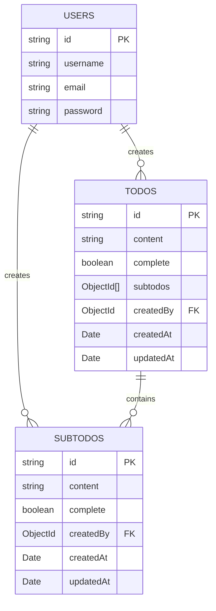
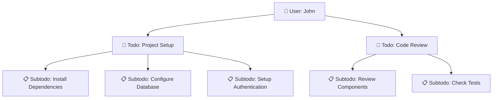

# 📝 Todo Application - Database Schema Documentation

https://app.eraser.io/workspace/J342pNzxMZxURA6khNtz

> A comprehensive Entity Relationship Diagram (ERD) for a hierarchical todo management system with user authentication and nested subtodos.

---

## 🏗️ Database Architecture Overview

This schema represents a **three-tier todo management system** where users can create todos, and each todo can have multiple subtodos, creating a hierarchical task organization structure.



---

## 👥 1. Users Entity

### 🎯 **Schema Definition**

```javascript
users {
  *id: string (Primary Key)
  username: string
  email: string
  password: string
}
```

### 📋 **Field Analysis**

| Field           | Type     | Constraints     | Purpose                                 |
| --------------- | -------- | --------------- | --------------------------------------- |
| **🔑 id**       | `string` | **Primary Key** | Unique identifier for each user         |
| **👤 username** | `string` | Required        | Display name for the user               |
| **📧 email**    | `string` | Required        | User's email address for authentication |
| **🔒 password** | `string` | Required        | Encrypted password for authentication   |

### 🎨 **Entity Characteristics**

- **Icon**: 👤 User
- **Role**: Central authentication and ownership entity
- **Relationships**: One-to-many with both todos and subtodos
- **Security**: Password field suggests authentication system

---

## 📝 2. Todos Entity (Main Tasks)

### 🎯 **Schema Definition**

```javascript
todos {
  *id: string (Primary Key)
  content: string
  complete: boolean
  subtodos: ObjectId[] → subtodos.id
  createdBy: ObjectId → users.id
  createdAt: Date
  updatedAt: Date
}
```

### 📋 **Field Analysis**

| Field            | Type         | Constraints           | Purpose                         |
| ---------------- | ------------ | --------------------- | ------------------------------- |
| **🔑 id**        | `string`     | **Primary Key**       | Unique identifier for each todo |
| **📄 content**   | `string`     | Required              | The actual task description     |
| **✅ complete**  | `boolean`    | Required              | Task completion status          |
| **🔗 subtodos**  | `ObjectId[]` | **Foreign Key Array** | References to related subtodos  |
| **👤 createdBy** | `ObjectId`   | **Foreign Key**       | References the creating user    |
| **📅 createdAt** | `Date`       | Auto-generated        | Timestamp of creation           |
| **🔄 updatedAt** | `Date`       | Auto-updated          | Timestamp of last modification  |

### 🎨 **Entity Characteristics**

- **Icon**: 📝 List
- **Role**: Primary task container
- **Relationships**:
  - Belongs to one user (many-to-one)
  - Contains many subtodos (one-to-many)
- **Features**: Hierarchical structure with nested subtasks

---

## 📋 3. Subtodos Entity (Sub-tasks)

### 🎯 **Schema Definition**

```javascript
subtodos {
  *id: string (Primary Key)
  content: string
  complete: boolean
  createdBy: ObjectId → users.id
  createdAt: Date
  updatedAt: Date
}
```

### 📋 **Field Analysis**

| Field            | Type       | Constraints     | Purpose                            |
| ---------------- | ---------- | --------------- | ---------------------------------- |
| **🔑 id**        | `string`   | **Primary Key** | Unique identifier for each subtodo |
| **📄 content**   | `string`   | Required        | The subtask description            |
| **✅ complete**  | `boolean`  | Required        | Subtask completion status          |
| **👤 createdBy** | `ObjectId` | **Foreign Key** | References the creating user       |
| **📅 createdAt** | `Date`     | Auto-generated  | Timestamp of creation              |
| **🔄 updatedAt** | `Date`     | Auto-updated    | Timestamp of last modification     |

### 🎨 **Entity Characteristics**

- **Icon**: 📋 List
- **Role**: Granular task breakdown
- **Relationships**:
  - Belongs to one user (many-to-one)
  - Belongs to one or more todos (many-to-many via array reference)
- **Features**: Independent tracking of completion status

---

## 🔗 4. Relationship Analysis

### **Primary Relationships**

#### 👤 **Users → Todos** (One-to-Many)

```
todos.createdBy → users.id
```

**Purpose**: Each todo is owned by exactly one user, but users can create multiple todos.

#### 👤 **Users → Subtodos** (One-to-Many)

```
subtodos.createdBy → users.id
```

**Purpose**: Each subtodo is owned by exactly one user, allowing for user-specific subtask management.

#### 📝 **Todos → Subtodos** (One-to-Many via Array)

```
todos.subtodos[] ← subtodos.id
```

**Purpose**: Each todo can contain multiple subtodos, creating a hierarchical task structure.

### **Relationship Patterns**



---

## 🎯 5. Schema Design Insights

### **✅ Strengths**

1. **🏗️ Hierarchical Organization**: Clear parent-child relationship between todos and subtodos
2. **👥 User Ownership**: Both todos and subtodos track their creators
3. **📊 Progress Tracking**: Independent completion status for todos and subtodos
4. **⏰ Audit Trail**: Created and updated timestamps for data tracking
5. **🔄 Flexible Structure**: Array-based relationship allows flexible subtodo assignments

### **🎨 Design Patterns**

#### **Ownership Pattern**

```javascript
// Every entity tracks its creator
createdBy: ObjectId → users.id
```

#### **Timestamp Pattern**

```javascript
// Consistent audit trail across entities
createdAt: Date;
updatedAt: Date;
```

#### **Completion Tracking Pattern**

```javascript
// Independent completion status
complete: boolean;
```

#### **Array Reference Pattern**

```javascript
// Flexible many-to-many relationships
subtodos: ObjectId[] → subtodos.id
```

---

## 📊 6. Data Flow & Use Cases

### **🎯 Typical User Journey**

1. **👤 User Registration/Login**

   ```
   CREATE user → users table
   ```

2. **📝 Todo Creation**

   ```
   CREATE todo → todos table
   SET todo.createdBy = user.id
   ```

3. **📋 Subtodo Addition**

   ```
   CREATE subtodo → subtodos table
   SET subtodo.createdBy = user.id
   PUSH subtodo.id → todo.subtodos[]
   ```

4. **✅ Completion Tracking**
   ```
   UPDATE todo.complete = true
   UPDATE subtodo.complete = true
   SET updatedAt = now()
   ```

### **🔍 Query Patterns**

#### **Get User's Complete Todo List**

```javascript
// Find all todos for a user with their subtodos
todos.find({ createdBy: userId }).populate("subtodos");
```

#### **Get Incomplete Tasks**

```javascript
// Find all incomplete todos and subtodos
todos.find({ createdBy: userId, complete: false });
subtodos.find({ createdBy: userId, complete: false });
```

#### **Hierarchical Task Structure**

```javascript
// Get todo with all its subtodos
todos.findById(todoId).populate({
  path: "subtodos",
  match: { complete: false },
});
```

---

## 🚀 7. Implementation Considerations

### **Database Technology Fit**

#### **🍃 MongoDB (Recommended)**

- Native ObjectId support
- Flexible array relationships
- Document-based structure matches the schema

#### **🐘 PostgreSQL Alternative**

- Use UUID for id fields
- Junction table for todos-subtodos relationship
- JSON fields for flexible data

### **⚡ Performance Optimizations**

1. **Indexing Strategy**

   ```javascript
   // Essential indexes
   users: { email: 1, username: 1 }
   todos: { createdBy: 1, complete: 1, createdAt: -1 }
   subtodos: { createdBy: 1, complete: 1 }
   ```

2. **Query Optimization**
   ```javascript
   // Populate subtodos efficiently
   todos.aggregate([
     { $match: { createdBy: userId } },
     {
       $lookup: {
         from: "subtodos",
         localField: "subtodos",
         foreignField: "_id",
         as: "subtodos",
       },
     },
   ]);
   ```

### **🔒 Security Considerations**

1. **Authentication**: Hash passwords before storage
2. **Authorization**: Ensure users can only access their own todos/subtodos
3. **Validation**: Validate ObjectId references to prevent injection
4. **Rate Limiting**: Prevent spam todo creation

---

## 📈 8. Scalability & Extensions

### **🎯 Potential Enhancements**

1. **🏷️ Categories/Tags**

   ```javascript
   todos: { tags: [String], category: ObjectId }
   ```

2. **📅 Due Dates**

   ```javascript
   todos: { dueDate: Date, priority: Number }
   ```

3. **🎨 Rich Content**

   ```javascript
   todos: { description: String, attachments: [ObjectId] }
   ```

4. **👥 Collaboration**

   ```javascript
   todos: { sharedWith: [ObjectId], permissions: Object }
   ```

5. **📊 Analytics**
   ```javascript
   users: { stats: { totalTodos: Number, completedTodos: Number } }
   ```

---

## 🎨 **Schema Summary**

This ERD represents a **well-structured, scalable todo management system** with:

- **👥 User-centric design** with clear ownership
- **📝 Hierarchical task organization** via todos → subtodos
- **⏰ Comprehensive audit trail** with timestamps
- **✅ Flexible completion tracking** at multiple levels
- **🔗 Efficient relationship modeling** using ObjectId references

The schema supports common todo app features while maintaining flexibility for future enhancements and scaling requirements.

---

\*🎯 **Database Schema designed for optimal task management and user experience\***
